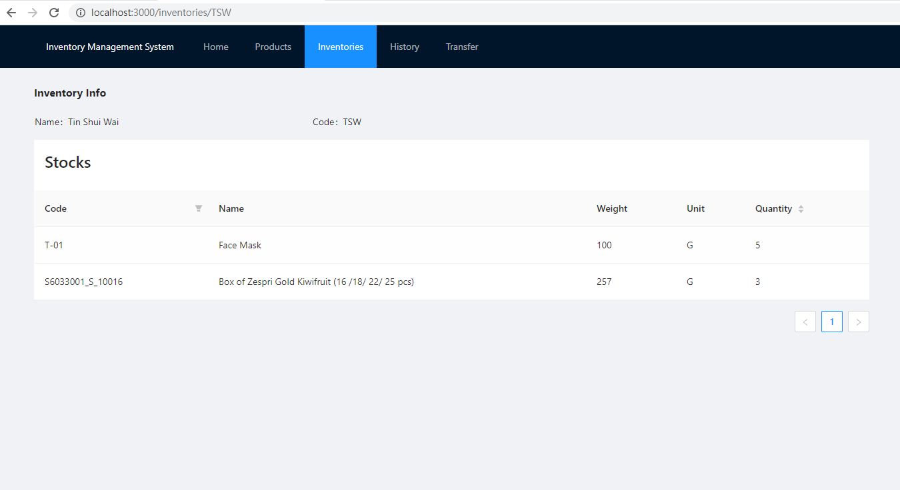

# Frameworks Using

Frontend: ReactJS with TypeScript  
Backend: Spring Boot  
Database: MySQL

# Testing / Development Environment
1. Chrome
2. Visual Studio Code with extensions (Spring Boot Dashboard)
3. MacOS / MS Windows 10

# Deploy JAR

```bash
$ cd server
$ chmod +x ./mvnw # For Linux Base OS, if permission denied
$ ./mvnw clean install -s .mvn/wrapper/settings.xml -DskipTests
```

# How to Compile With Docker

```bash
$ docker-compose up -d --build
```

# Screenshots

## Product List

`Navbar -> Products` Or [Browser](http://localhost:3000/products)


## Create Product Via Upload UI

`Navbar -> Products -> Create Product(Button)`


## Create Product Via Upload Csv

`Navbar -> Products -> Upload CSV(Button)`


## Check Product Stock

`Navbar -> Products -> Click one of the row in the table` Or http://loaclhost:3000/products/productCode


## Check Inventory List

`Navbar -> Inventory`


## Create Inventory Via UI

`Navbar -> Inventory -> Create Inventory(Button)`


## Add Product Quantity Via Uplaod Csv

`Navbar -> Inventory -> Upload CSV(Button)`


## List out inventory's stock

`Navbar -> Inventory -> Click one of the row` or http://localhost:3000/inventories/inventoryCode or `Click one of the row in Check Product Stock`


## Transfer the stock from one inventory to another via UI

`Navbar -> Inventory -> Click one of the row -> Click one of the row`


## Transfer History

`Navbar -> Transfer`


## Transfer the stock from one inventory to another via CSV

`Navbar -> Transfer`


# TODO List

- [x] develop a light version Warehouse Inventory System
- [x] able to store product data via csv file consumption.
- [x] able to store quantities of such products in different locations via csv file consumption.
- [x] UI to show inventory level of given product code
- [x] able to transfer inventory from one location to another given amount of quantity and product code via UI
- [x] able to transfer inventory from one location to another given amount of quantity and product code via upload Csv

# Diary

Since this is my first time to use Java Spring Boot to build the API Server, so i have used many time to study the techniques which is using in this project. For example: Jpa.

- Day 1:  
  Create the Spring Boot Project, and try to create a Hello World API Controlelr.

- Day 2:  
  Connect with database and Create all RestController with Real Data and data validation.

- Day 3:  
  Create the React App and migrate the API as well as documentations.
